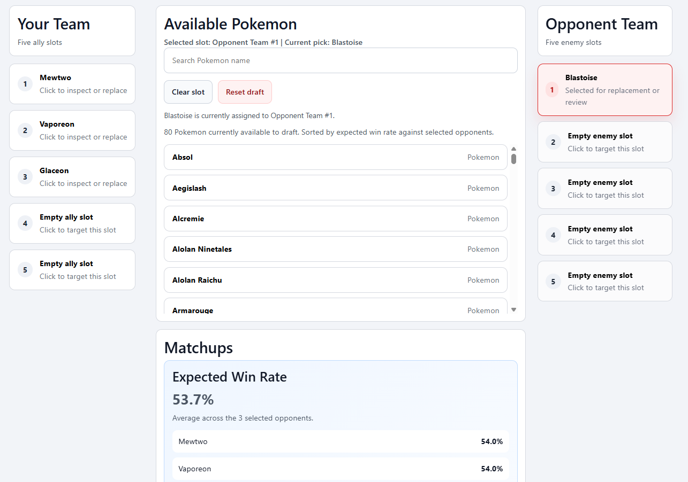

# UniteDrafter

A local draft assistant for Pokémon Unite. You fill both teams' slots as a draft happens. For the slot you're picking, the app ranks every remaining Pokémon by its expected win rate against the opponents already chosen. The win rates come from public matchup statistics, scraped and stored in a local SQLite database.



**Stack:** C# / .NET 10, Blazor Server, SQLite, Playwright, xUnit (63 tests).

## Status: archived

Development stopped in April 2026 because the source data can't support the goal. The matchup statistics are incomplete for low-usage Pokémon, and the gaps exist at the source itself. For example, Falinks had 20 recorded matchups out of 80 possible. A draft tool that silently fills those gaps with guesses would be worse than none, and nothing can recover the missing data.

The site has since been redesigned and its guide pages moved to new addresses, so the live refresh no longer finds them. If a refresh fails, it fails safely: when any page fails, the refresh leaves existing data untouched. The screenshot above was produced from a sample page captured earlier, which is kept as a test fixture.

## Technical highlights

- **Reverse-engineered data source.** The site shipped its statistics as an encrypted blob inside the page data. [Decrypter.cs](src/UniteDrafter.SourceUpdate/Decrypter/Decrypter.cs) finds the blob, separates the key from the ciphertext, and decrypts it with AES in counter mode. It generates the counter stream by hand on top of the .NET block cipher. The first version was a Python script. It was ported to C# with tests against a captured page, so later changes could be checked against real data.
- **All-or-nothing source refresh.** `refresh-db` downloads every page into a hidden staging folder. If any page fails, it discards the staging folder and changes nothing. If all succeed, it swaps the staging folder in, keeps the previous folder as a backup, and restores that backup if the swap fails ([DatabaseRefreshWorkflow.cs](src/UniteDrafter.SourceUpdate/Data/DatabaseRefreshWorkflow.cs)). Known gap: the database rebuild that follows drops its tables before the import transaction begins. So an import that fails partway would leave an empty database, not the previous one.
- **Missing data is reported, never guessed.** When some opponents have no matchup data, [ExpectedWinRateCalculator.cs](src/UniteDrafter.Core/Services/ExpectedWinRateCalculator.cs) averages over the opponents it does have and names the missing ones in the UI. It never presents a partial average as complete. Candidates with no usable data sort below candidates with data ([AvailablePokemonSorter.cs](src/UniteDrafter.Core/Services/AvailablePokemonSorter.cs)).
- **Draft rules live in plain C#, not the UI.** [DraftSession.cs](src/UniteDrafter.Core/Services/DraftSession.cs) handles slot selection, duplicate-pick prevention, clearing and reset, and returns typed results instead of throwing. That's what lets the tests cover it without a browser.

## Design decisions

- **Blazor over React.** The goal was a working end-to-end product quickly, with one language across the UI, the logic and the scraper. The trade-off is that the UI is tied to a .NET server process.
- **SQLite over a server database.** The app is local and single-user, and its data is small and mostly read. A single file needs no setup, and the schema is plain SQL that would carry over to a server database if the app ever needed one.
- **Each matchup stored from both sides.** Every pair has two rows, one per Pokémon. That doubles the table's size, but drafting only reads: it asks "how does X do against these opponents?" many times per pick. Storing both sides means each question is a single indexed lookup.
- **Raw pages kept, not trimmed.** The scraper stores each full decrypted page even though only the matchup section is used. That way, adding features later needs no re-scrape.

## Project layout

| Project | Role |
| --- | --- |
| `src/UniteDrafter.Frontend` | Blazor Server UI: the draft board and roster list |
| `src/UniteDrafter.Core` | Draft session, win-rate calculation, SQLite readers and schema |
| `src/UniteDrafter.SourceUpdate` | Scraping with Playwright, decryption, staged refresh and import |
| `src/UniteDrafter.Backend` | CLI for refreshing, rebuilding and querying the database |
| `tests/` | xUnit tests for the database and decryption layers |

## Running it

Requires the .NET 10 SDK.

```powershell
dotnet test UniteDrafter.sln
```

A fresh clone has no data, and the live refresh no longer works against the redesigned site (see *Status*). To see the app with the sample data behind the screenshot:

```powershell
mkdir data/Database/GuideSources
copy tests/Decrypter/Fixtures/best-builds-movesets-and-guide-for-blastoise.json data/Database/GuideSources/
dotnet run --project src/UniteDrafter.Backend -- rebuild-db
dotnet run --project src/UniteDrafter.Frontend
```

This sample holds Blastoise's matchups only. Put Blastoise in one team's slot and some opponents in the other team's slots to see its expected win rate. The CLI's other commands are listed in [src/UniteDrafter.Backend/README.md](src/UniteDrafter.Backend/README.md).

This is a personal, non-commercial project, built for learning and as a portfolio piece. Matchup statistics come from [UniteAPI](https://uniteapi.dev). As of October 2026, UniteAPI publishes a privacy policy but no terms of service, and its robots.txt places no restrictions on crawlers. The scraper made low-volume requests, and this repository does not redistribute the scraped dataset. If UniteAPI's maintainers would rather it not be scraped, I'll take it down.
